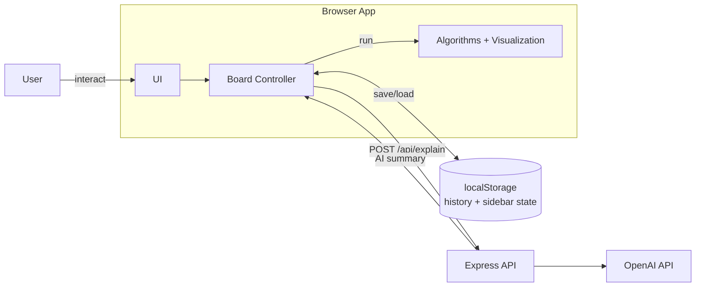

# Pathfinding Visualizer

An interactive educational tool for visualizing pathfinding algorithms — understand not just *what* the algorithm does, but *why* it makes each decision. Featuring a **Feynman-style Insight panel**, **AI-powered summaries**, **playback controls**, and a **7-slide onboarding tutorial**.


---

## ✨ Features

### Core Visualization
- 🎯 **8 Pathfinding Algorithms** — Dijkstra, A*, Greedy Best-first, Swarm, Convergent Swarm, Bidirectional Swarm, BFS, DFS
- 🧱 **Interactive Grid** — Click to draw walls, hold `W` to place weighted nodes
- 🎨 **7 Maze Generators** — Recursive division (horizontal/vertical skew), random walls, random weights, staircase, and blank grid
- ⚡ **3 Speed Modes** — Fast, Average, Slow

### Educational Tools
- 📖 **Step-by-Step Insight Panel** — Real-time Feynman-style explanations of each algorithm decision: node selection reason, cost breakdowns (g/h/f), neighbor evaluation, frontier size, and visited count
- 💡 **Feynman Tooltips** — `?` icons throughout the Insight panel explain every concept in beginner-friendly language
- 🤖 **AI-Powered Summary** — 5-sentence beginner-friendly run summary via server-side OpenAI integration (with deterministic fallback)
- ⚖️ **Weight Slider** — Experiment with cost values (0–50) in the sidebar
- 📊 **Results Bar** — Post-run display of Path Cost, Length, and Visited count
- 🔍 **"Why This Path?"** — Weight impact analysis showing detour costs, efficiency rating, and counterfactual comparisons

### Controls & Navigation
- ▶️ **Playback Controls** — Pause / Resume / Step Forward during Average and Slow speed modes
- 🎓 **7-Slide Onboarding Tutorial** — Animated walkthrough with keyboard navigation and accessibility (ARIA, focus trap)
- 🧩 **Maze Selector Onboarding** — Card-grid modal to pick a maze pattern after the tutorial
- 📋 **Algorithm Comparison Modal** — Side-by-side table of all 8 algorithms covering optimality, completeness, complexity, and per-algorithm detail modals with pseudocode
- ℹ️ **Algorithm Info Modals** — Navbar algorithm names open informational modals (not algorithm selectors)
- 📑 **Two-Tab Sidebar** — "Controls" tab for settings, maze, weight, actions, history, and legend; "Insight" tab for live algorithm analysis

### History & Replay
- 💾 **Run History** — Save last 5 runs in localStorage with full board state restoration
- 🔄 **Replay** — Re-animate a saved run
- 🗑️ **Manage** — Delete individual saved runs

---

## 🚀 Getting Started

### Prerequisites
- Node.js >= 18
- npm or yarn

### Installation

```bash
# Clone the repository
git clone https://github.com/your-username/Pathfinding-Visualizer.git
cd Pathfinding-Visualizer

# Install dependencies
npm install

# Copy environment template
cp .env.example .env

# Start the server (with nodemon auto-reload)
npm start
```

Open http://localhost:1337 in your browser.

### Development Commands

| Command | Description |
|---------|-------------|
| `npm start` | Start dev server with nodemon (port 1337) |
| `npm run build:client` | Bundle client JS via Browserify |
| `npm run watch` | Watch mode — auto-rebuild bundle on file changes |
| `npm test` | Run automated tests for algorithm behaviour, controls, persistence, fallback, explanation logic, and schema integrity |

### Enable AI Explanations (Optional)

1. Get an API key from [OpenAI Platform](https://platform.openai.com/)
2. Edit `.env` file:
   ```
   OPENAI_API_KEY=sk-your-actual-key-here
   ```
3. Restart the server

> Without an API key, the app uses deterministic fallback explanations (still fully functional!).

---

## 📖 Usage Guide

### First-Time Experience
1. **Onboarding Tutorial** — A 7-slide animated walkthrough appears on first visit, introducing concepts like the grid, algorithms, obstacles, and controls. Navigate with keyboard arrows or on-screen buttons. Click "Skip intro" to dismiss.
2. **Maze Selector** — After the tutorial, a card-grid modal lets you pick a maze pattern (recursive division, random walls, staircase, etc.) or start with a blank grid.

### Configuring the Grid
1. **Set Start/Target** — Drag the green (start) and red (target) nodes to reposition
2. **Draw Walls** — Click and drag on empty cells
3. **Draw Weights** — Hold `W` + click (only affects weighted algorithms)
4. **Adjust Weight Value** — Use the Weight Slider (0–50) in the sidebar Controls tab
5. **Generate Mazes** — Use the Maze dropdown in the sidebar Controls tab

### Running an Algorithm
1. **Select Algorithm** — Choose from the **playback pod dropdown** at the bottom of the screen
2. **Set Speed** — Choose Fast / Average / Slow from the speed dropdown
3. **Visualize!** — Click the "Visualize!" button

> **Note:** Clicking algorithm names in the **navbar** opens informational modals (with pseudocode and details), not algorithm selection. Algorithm selection is done via the playback pod dropdown.

### During Visualization
- The **Insight tab** (sidebar) updates live with:
  - Current step number and node coordinates
  - Cost breakdown (g/h/f values)
  - "What's Happening?" — natural-language explanation of the current decision
  - Frontier size and visited count metrics
- **Playback Controls** (Pause / Resume / Step Forward) appear in Average and Slow speed modes

### After Visualization
- **Results Bar** shows Path Cost, Length, and Visited count
- **"Why This Path?"** renders a weight impact analysis in the Insight tab
- **AI Summary** auto-requests from the server (or shows fallback text)
- **Run auto-saved** to History (visible in the sidebar Controls tab)
- **Drag endpoints** → instant recalculation (no re-animation needed)
- **Clear Path / Clear Walls / Clear Board** buttons in the sidebar
- **Browse History** → Load a past run to restore full board state, or Replay to re-animate

---

## 🧠 Algorithms

### Weighted Algorithms
| Algorithm | Optimal | Heuristic | Description |
|-----------|---------|-----------|-------------|
| **Dijkstra's** | ✅ | ❌ | The classic; guarantees shortest path |
| **A* Search** | ✅ | ✅ | Best overall; uses heuristic for speed |
| **Greedy Best-first** | ❌ | ✅ | Fast but may not find shortest path |
| **Swarm** | ❌ | ✅ | Blend of Dijkstra and A* (see below) |
| **Convergent Swarm** | ❌ | ✅ | Faster, more heuristic-heavy Swarm |
| **Bidirectional Swarm** | ❌ | ✅ | Swarm from both ends |

### Unweighted Algorithms
| Algorithm | Optimal | Description |
|-----------|---------|-------------|
| **Breadth-first Search** | ✅ | Level-by-level exploration |
| **Depth-first Search** | ❌ | Goes deep first; can find very long paths |

---

## ⚙️ Configuration

### Environment Variables

| Variable | Required | Default | Description |
|----------|----------|---------|-------------|
| `OPENAI_API_KEY` | No | - | OpenAI API key for AI explanations |
| `PORT` | No | 1337 | Server port |

### Cost Model

The algorithm uses this cost formula for weighted algorithms:
```
Edge Cost = Base (1) + Turn Penalty (0-2) + Node Weight (0-50)
```

| Turn Type | Penalty |
|-----------|---------|
| Straight | +0 |
| 90° turn | +1 |
| 180° turn (backtrack) | +2 |

> **Note:** Turn penalties are used in the internal search logic. However, the **results-bar Path Cost display** sums base cost + node weights only, and does not include turn penalties.

---

## 🔌 API Reference

### POST /api/explain

Generate an AI explanation for a completed pathfinding run.

- **Rate Limit:** 30 requests per 15-minute window per IP
- **Security:** Protected by Helmet (CSP headers) and express-rate-limit

**Request Body:**
```json
{
  "algorithmKey": "dijkstra",
  "meta": {
    "algorithmFamily": "weighted",
    "guaranteesOptimal": true,
    "usesHeuristic": false,
    "complete": true,
    "selectionRule": "Always expand the node with the lowest total cost found so far.",
    "bestFor": "Finding guaranteed shortest paths in weighted graphs",
    "weakness": "Explores in all directions equally"
  },
  "start": "row 10, col 5",
  "target": "row 10, col 25",
  "visitedCount": 846,
  "pathLength": 38,
  "directDistance": 20,
  "detourSteps": 18,
  "visitedPercent": 42,
  "wallCount": 47,
  "weightCount": 5,
  "weightsInPath": 2,
  "efficiency": 0.53,
  "pathSample": ["row 10, col 5", "...", "row 10, col 25"]
}
```

**Response (AI enabled):**
```json
{
  "explanation": "Dijkstra's Algorithm checked 846 cells (42% of the grid)...",
  "source": "ai"
}
```

**Response (fallback):**
```json
{
  "explanation": "The Dijkstra's Algorithm explored 846 cells (42% of the grid)...",
  "source": "fallback"
}
```

> If no API key is configured or the OpenAI call fails, `source` will be `"fallback"` with a deterministic 5-sentence explanation.

---

## 🧪 Testing

```bash
# Run all unit tests
npm test

# Expected pass lines include:
# pathfindingAlgorithmsBehavior tests passed.
# animationController tests passed.
# runPersistence tests passed.
# aiExplainFallback tests passed.
# weightImpactAnalyzer tests passed.
# algorithmDescriptions schema tests passed.
```

### Manual Testing Checklist
- [ ] Grid renders correctly on page load
- [ ] Tutorial displays and can be skipped
- [ ] Maze onboarding modal appears after tutorial
- [ ] Can draw walls and weights
- [ ] Can drag start/target nodes
- [ ] Weight slider updates weight value (0–50)
- [ ] All 8 algorithms run without errors
- [ ] Animation plays at all 3 speeds
- [ ] Playback controls (Pause/Resume/Step) work in Average/Slow modes
- [ ] Insight panel updates live during animation
- [ ] Results bar shows Path Cost, Length, Visited after run
- [ ] "Why This Path?" analysis renders in Insight tab
- [ ] AI Summary renders (or fallback text)
- [ ] History saves runs and displays in Controls tab
- [ ] Can load and replay a saved run
- [ ] Dragging endpoints after a run triggers instant recalculation
- [ ] Algorithm info modals open from navbar
- [ ] "Compare All" modal shows all 8 algorithms
- [ ] Clear Path / Walls / Board buttons work
- [ ] Maze generation works (all types from sidebar dropdown)

---

## 📁 Project Structure

```
pathfindingredesign/
├── index.html                        # Single HTML entry point
├── server.js                         # Express server + /api/explain + Helmet + rate limit
├── package.json                      # Dependencies & scripts
├── .env.example                      # Environment template
│
├── docs/                             # Documentation (15 files)
│   ├── 00-context-and-vision.md
│   ├── 01-product-requirements.md
│   ├── 02-feature-spec-step-by-step-explanations.md
│   ├── 03-feature-spec-history-localstorage.md
│   ├── 04-feature-spec-path-cost-experimentation.md
│   ├── 05-architecture-and-refactor-plan.md
│   ├── 06-delivery-plan-testing-and-metrics.md
│   ├── 08-current-codebase-analysis.md
│   ├── 09-accessibility.md
│   ├── 10-feature-spec-insight-feynman-tooltips.md
│   ├── 11-research-report-implementation-plan.md
│   ├── 12-project-planning-and-architecture-corrected.md
│   ├── 13-high-level-system-architecture.md
│   └── conventional-commits-cheatsheet.md
│
├── tests/
│   ├── pathfindingAlgorithmsBehavior.test.js
│   ├── animationController.test.js
│   ├── runPersistence.test.js
│   ├── aiExplainFallback.test.js
│   ├── weightImpactAnalyzer.test.js
│   └── algorithmDescriptionsSchema.test.js
│
└── public/
    ├── browser/
    │   ├── board.js                  # Main controller (Board constructor)
    │   ├── node.js                   # Node data model
    │   ├── getDistance.js            # Turn-aware direction/distance utility
    │   ├── bundle.js                 # Browserify output (do not edit)
    │   │
    │   ├── pathfindingAlgorithms/
    │   │   ├── astar.js
    │   │   ├── weightedSearchAlgorithm.js
    │   │   ├── unweightedSearchAlgorithm.js
    │   │   ├── bidirectional.js
    │   │   └── testAlgorithm.js
    │   │
    │   ├── mazeAlgorithms/
    │   │   ├── recursiveDivisionMaze.js
    │   │   ├── otherMaze.js
    │   │   ├── otherOtherMaze.js
    │   │   ├── simpleDemonstration.js
    │   │   ├── stairDemonstration.js
    │   │   └── weightsDemonstration.js
    │   │
    │   ├── animations/
    │   │   ├── animationController.js    # Pause / Resume / Step controls
    │   │   ├── launchAnimations.js       # Timed animation sequences
    │   │   ├── launchInstantAnimations.js # Synchronous (instant) animation
    │   │   └── mazeGenerationAnimations.js
    │   │
    │   └── utils/
    │       ├── aiExplain.js              # fetch POST /api/explain
    │       ├── algorithmDescriptions.js  # Algorithm metadata registry
    │       ├── algorithmCompare.js       # Comparison modal logic
    │       ├── algorithmModal.js         # Per-algorithm info modal
    │       ├── explanationTemplates.js   # Feynman-style text templates
    │       ├── gridMetrics.js            # Pure grid analysis functions
    │       ├── historyStorage.js         # localStorage CRUD for runs
    │       ├── historyUI.js              # Run history cards + replay
    │       ├── mazeSelector.js           # Maze onboarding card-grid
    │       ├── runSerializer.js          # Board state → JSON serializer
    │       └── weightImpactAnalyzer.js   # "Why This Path?" analysis
    │
    └── styling/
        ├── cssBasic.css                  # Main stylesheet
        └── cssPokemon.css                # Alternate theme
```

---

## 🏗️ Architecture



Main logic runs in the browser. The server is only used for AI summaries and static serving.

- Browser is where the app mainly runs.
- `Board Controller` is the central coordinator.
- History stays in `localStorage`, and AI goes through Express.

---

## 🤝 Contributing

Contributions are welcome! Please read the documentation in the `/docs` folder before making changes. The project uses conventional commits — see `docs/conventional-commits-cheatsheet.md` for reference.

---

## 📄 License

ISC License

---

## 💡 About the Swarm Algorithm

The Swarm Algorithm is an algorithm that I — at least presumably so (I was unable to find anything close to it online) — co-developed with a good friend and colleague, Hussein Farah.

The algorithm is essentially a mixture of Dijkstra's Algorithm and A* Search; more precisely, while it converges to the target node like A*, it still explores quite a few neighboring nodes surrounding the start node like Dijkstra's.

The algorithm differentiates itself from A* through its use of heuristics: it continually updates nodes' distance from the start node while taking into account their estimated distance from the target node. This effectively "balances" the difference in total distance between nodes closer to the start node and nodes closer to the target node, which results in the triangle-like shape of the Swarm Algorithm.

We named the algorithm "Swarm" because one of its potential applications could be seen in a video-game where a character must keep track of a boss with high priority (the target node), all the while keeping tracking of neighboring enemies that might be swarming nearby.
