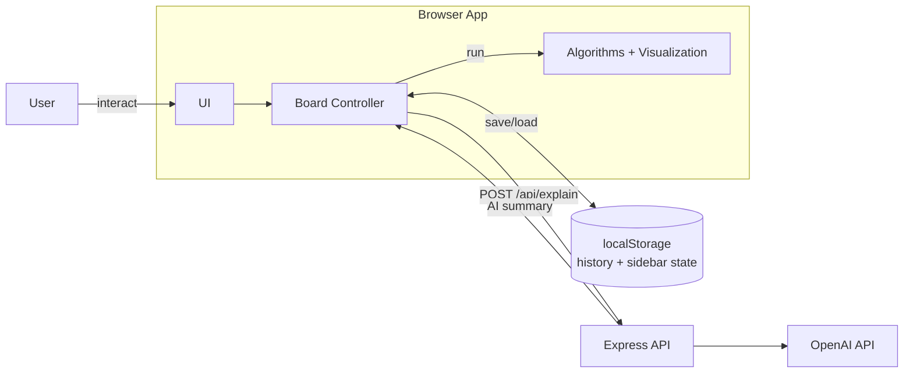

# High-Level System Architecture

Main logic runs in the browser. The server is only used for AI summaries and static serving.

- Browser is where the app mainly runs.
- `Board Controller` is the central coordinator.
- History stays in `localStorage`, and AI goes through Express.
